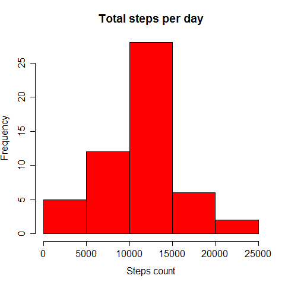
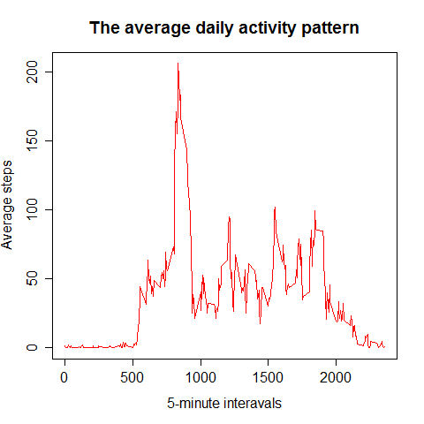
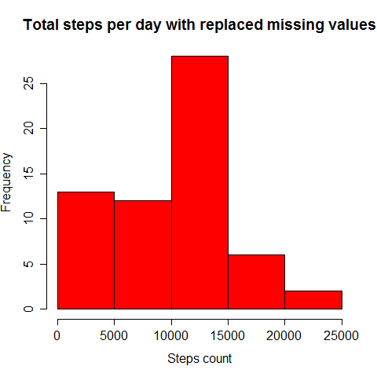
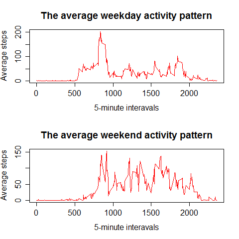

title: "RepData_PeerAssessment1"
================================

# Loading and preprocessing the data

First we load data from csv file and convert it to a data frame. Then we create a clean data set removing all the rows with NAs and converting all date values to date class.

```{r echo=TRUE}
data <- read.csv('activity.csv')
df <- data.frame(data)
df_clean <- na.omit(df)
df_clean$date <- as.Date(df_clean$date)
head(df_clean)
```

# What is mean total number of steps taken per day?

Now we should calculate the total number of steps taken per day. In order to do this we will extract using aggregate function a table containing two columns: with dates and relative total step counts. Then we can draw an appropriate histogram and calculate the mean and median of the total number of steps taken per day.

```{r echo=TRUE}
total_steps = aggregate(steps ~ date, data = df_clean, FUN = sum)
head(total_steps)
hist(total_steps$steps, main = "Total steps per day", xlab = "Steps count", col = "red")
mean_steps <- mean(total_steps$steps)
median_steps <- median(total_steps$steps)
```



#### As we can see the mean value of steps taken per day is approximately `r as.integer(mean_steps)` and the median value is `r median_steps`.

# What is the average daily activity pattern?

To find the average daily activity pattern we should again extract a table containing interval values combined with step averages. After that we can plot the data and find the interval containing the maximum number of steps taken on average across all the days.

```{r echo=TRUE}
interval_averages <- aggregate(steps ~ interval, data = df, FUN = mean)
head(interval_averages)
plot(interval_averages, type = "l", col = "red", main = "The average daily activity pattern", xlab = "5-minute interavals", ylab = "Average steps")
max_int = interval_averages$interval[interval_averages$steps == max(interval_averages$steps)]
```



#### 5-minute interval containing the maximum number of steps on average across all the days in the dataset is ```r max_int```.

# Imputing missing values

To calculate the total number of missing values in the dataset we have to return to the initial data frame with NAs and sum all the rows containing them.

```{r echo=TRUE}
number_of_missing_values = sum(is.na(df))
```

#### The total number of missing values in the dataset is `r number_of_missing_values`.

Now we need to replace missing values with some other. In order to do this I will use 5-minute interval mean values. Script below creates new data frame and substitutes NAs with the interval mean values. After that corrected total daily steps are evaluated and extracted into seperate data set, on the basis of which the histogram of the total number of steps taken each day is plotted and the mean and median values are calculated.

```{r echo=TRUE, warning=FALSE}
df_completed <- merge(df, interval_averages, by = "interval")
colnames(df_completed)[2] = "steps"
colnames(df_completed)[4] = "mean_steps"
df_completed$steps <- replace(df_completed$steps, is.na(df_completed$steps), df_completed$mean_steps)
df_completed <- df_completed[1:3]
head(df_completed)
total_steps_completed <- aggregate(steps ~ date, data = df_completed, FUN = sum)
head(total_steps_completed)
hist(total_steps_completed$steps, main = "Total steps per day with replaced missing values", xlab = "Steps count", col = "red")
mean_tsc <- mean(total_steps_completed$steps)
median_tsc <- median(total_steps_completed$steps)
```



#### Corrected mean of total number of steps taken per day approximately equals ```r as.integer(mean_tsc)``` and median equals ```r as.integer(median_tsc)```. As we can see the median with filled NAs is slightly smaller than the original one, while the mean estimate has decreased quite a lot. Overall daily steps distribution has become less normal as the lower-tail values have considerably increased. Consequently the estimates of the total daily number of steps have diminished.

# Are there differences in activity patterns between weekdays and weekends?

First create a new column in the completed data frame from the previous step. Then sort values in this column as "weekend" and "weekday". After that it is possible to plot the necessary graphs and contemplate the difference or its absence.

```{r echo=TRUE}
df_completed["day"] <- weekdays(as.Date(df_completed$date))
df_completed$day[df_completed$day %in% c("суббота", "воскресенье", "Saturday", "Sunday")] <- "weekend"
df_completed$day[df_completed$day != "weekend"] <- "weekday"
weekday_ia <- aggregate(steps[day == "weekday"] ~ interval[day == "weekday"], data = df_completed, FUN = mean)
weekend_ia <- aggregate(steps[day == "weekend"] ~ interval[day == "weekend"], data = df_completed, FUN = mean)
par(mfrow=c(2,1))
plot(weekday_ia, type = "l", col = "red", main = "The average weekday activity pattern", xlab = "5-minute interavals", ylab = "Average steps")
plot(weekend_ia, type = "l", col = "red", main = "The average weekend activity pattern", xlab = "5-minute interavals", ylab = "Average steps")
```



#### As we can see from the above plots activity patterns differ between weekdays and weekends. Individual seem to wake up and start his daily movements earlier during the weekdays, while his activity on the weekends is distributed more evenly (without obvious daily peak) and we can see that during those days individual is more active in the evening.
